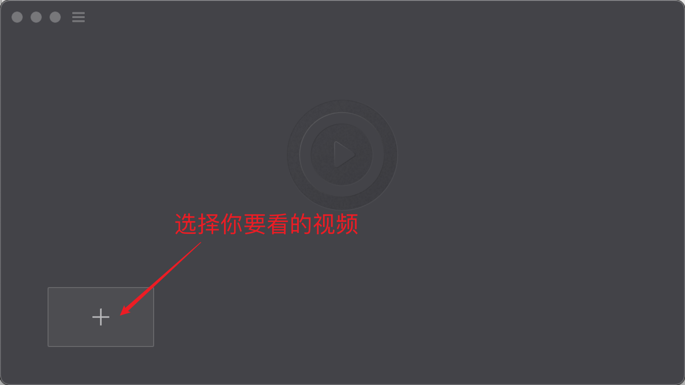
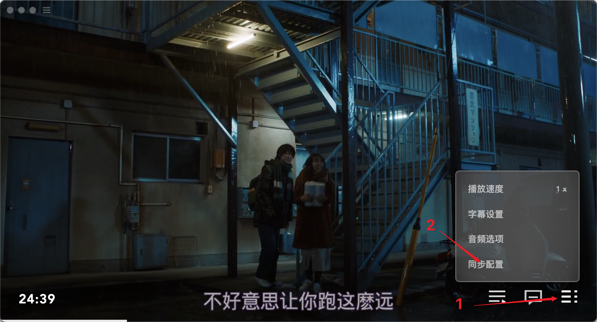
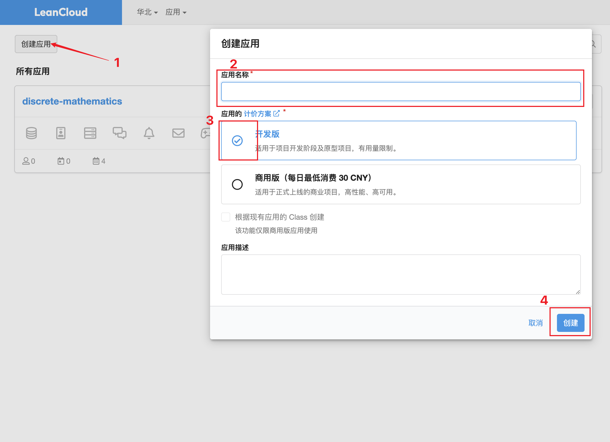
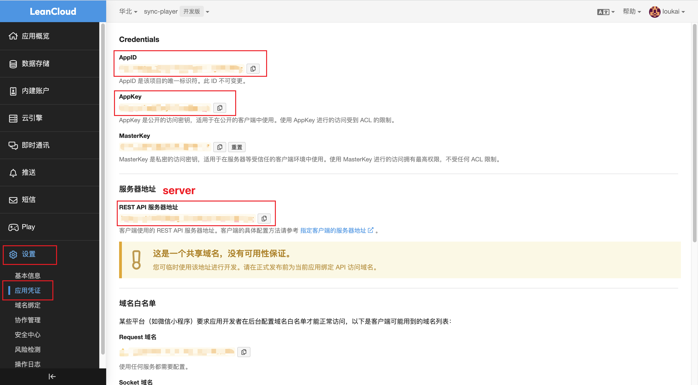
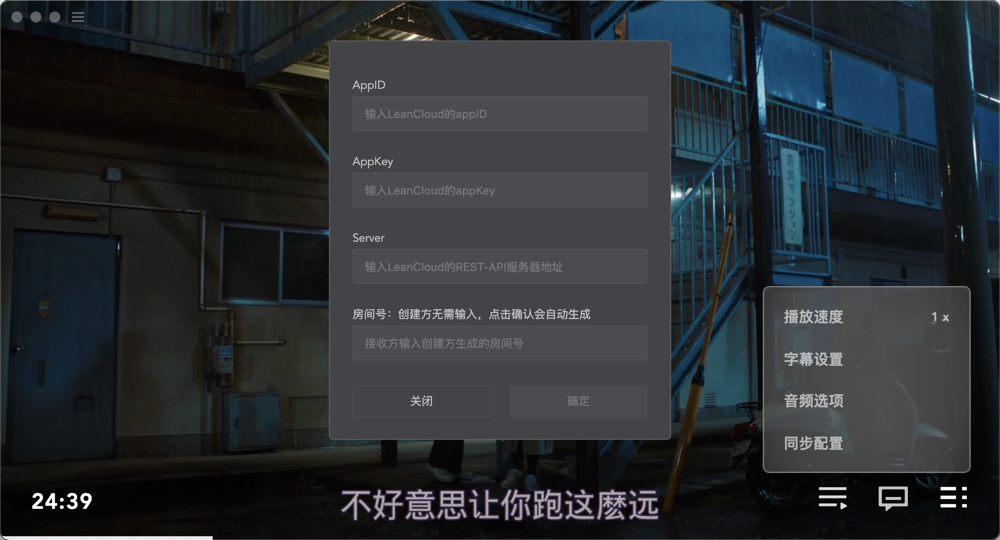

# 支持多方同步播放的视频播放器

## 功能介绍
基于splayer开源代码二次开发，增加同步播放功能，可自定义LeanCloud接口。
同步功能基于LeanCloud的即时通讯服务实现，支持多客户端同步播放，暂停，倍速，拖动进度条功能等。
支持Windows和MacOS。（现阶段仅支持本地影片，各方都需要在本地存有同一个视频才可以进行同播）

## 如何使用播放器
1. 首先，您需要注册一个LeanCloud免费账号以备使用 ([LeanCloud官网](https://www.leancloud.cn/)) ，LeanCloud为免费用户提供120次/分钟的免费消息次数，足够个人使用。
2. 打开播放器，首先选择你要看的电影开始播放。
3. 点击右下角菜单按钮展开菜单栏，点击同步配置。
4. 从您注册好的LeanCloud账号中获取需要的Api参数，首先进入LeanCloud控制台，点击创建应用>随便填一个应用名称>创建。
5. 进入您刚刚创建的应用。点击*设置>应用凭证*可以看到我们需要的参数。
6. 将参数对应填入播放器配置页面，点击确定即可。其中创建方可以不填写房间号或者填写之前使用过的房间号（连接成功后4个参数会自动保存，下次使用时可以直接使用上一次的房间号），除创建方以外的其他人都需要填写和创建方填写/自动生成的房间号一样的房间号，不可留空。

> 注意事项：
> 连接成功后4个参数均不可修改，如填错房间号，需要退出视频播放页面重新进入才可以修改

## 如何运行
1. `yarn install` 安装依赖，可能需要梯子
2. `npm run build` 打包发布
3. `npm run dev` 以开发模式运行

This project was generated with [electron-vue](https://github.com/SimulatedGREG/electron-vue)@[7c4e3e9](https://github.com/SimulatedGREG/electron-vue/tree/7c4e3e90a772bd4c27d2dd4790f61f09bae0fcef) using [vue-cli](https://github.com/vuejs/vue-cli). Documentation about the original structure can be found [here](https://simulatedgreg.gitbooks.io/electron-vue/content/index.html).
